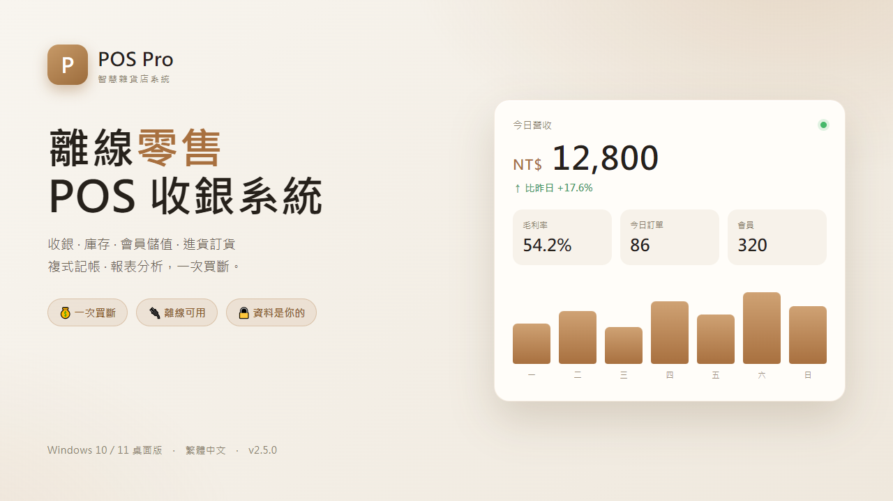
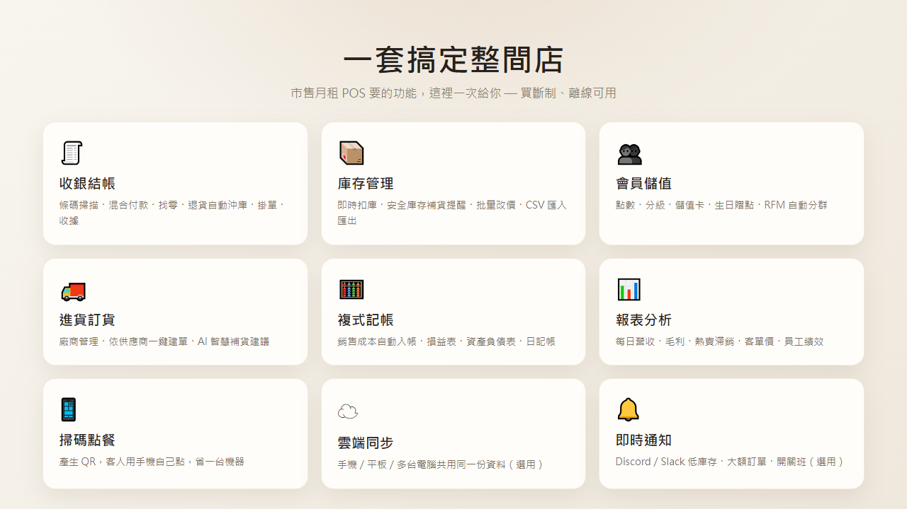

<p align="center">
  
</p>

<h1 align="center">POS Easy</h1>

<p align="center">
  離線優先的零售 POS 收銀系統 — 收銀 · 庫存 · 會員儲值 · 進貨訂貨 · 複式記帳 · 報表<br>
  <i>An offline-first retail POS for small shops · Windows desktop (Electron) + PWA · 繁體中文</i>
</p>

<p align="center">
  
  
  
  
</p>

---

## 這是什麼

POS Easy 是為**印尼 warung（雜貨小吃店）/ 小型零售**打造的 POS 系統。資料預設存在本機（桌面版走 SQLite、瀏覽器版走 localStorage），**離線就能跑**、不綁月租；雲端同步是選用。

## ✨ 功能

- 🧾 **收銀** — 條碼掃描、混合付款、找零、退貨（自動沖庫存/點數）、掛單、收據
- 📦 **庫存** — 即時扣庫、安全庫存提醒、批量改價、CSV 匯入匯出、商品變動歷史、過期警示
- 👥 **會員** — 點數、分級、儲值卡、生日贈點、RFM 自動分群
- 🚚 **進貨訂貨** — 廠商管理、依供應商一鍵建單、AI 智慧補貨建議、歷史單價
- 🧮 **複式記帳** — 銷售/成本/儲值自動入帳、損益表、資產負債表、日記帳、CSV 匯出
- 📊 **報表** — 每日營收、毛利、熱賣滯銷、客單價、員工績效
- 📱 **顧客掃碼點餐**　☁️ **雲端同步（Supabase，選用）**　🔔 **Discord / Slack 通知（選用）**

## 📸 截圖



## 🚀 安裝

### 一般使用者
到 [Releases](../../releases) 下載 `POS Easy Setup x.x.x.exe`，安裝即可（Windows 10 / 11）。

> 若出現「Windows 已保護您的電腦／發行者不明」→ 點 **「其他資訊」→「仍要執行」**（安裝檔未經數位簽章，非病毒）。

預設登入：`老闆 / 1234`（**請登入後立刻到「設定 → 員工帳號」改密碼**）。

### 自行編譯 / 開發

```bash
npm install
npm run dev            # 瀏覽器開發伺服器 (localhost:5173)
npm run electron:dev   # 桌面版（Electron）開發
npm run electron:build # 打包 Windows 安裝檔 → release/
npm test               # 單元測試 (vitest)
```

## ☁️ 雲端同步（選用）

讓手機 / 平板 / 多台電腦共用同一份資料。申請免費 Supabase 後，依 [SETUP_SUPABASE.md](SETUP_SUPABASE.md) 設定。

## ⚠️ 安全須知

- **首次登入請立刻改掉預設密碼**（`老闆/1234`、`員工/0000`）。
- 單店模式的 [`supabase/schema.sql`](supabase/schema.sql) **預設關閉 RLS** → 任何拿到 anon key 的人都能讀寫全部資料（含員工密碼雜湊）。**anon key 切勿外流**；多人 / 公開情境請依 SETUP_SUPABASE.md 開啟 RLS。
- Releases 的安裝檔**未經程式碼簽章**（Windows SmartScreen 會提示）。

## 🧱 技術

Electron 33 · better-sqlite3 · React 18 · Vite 5 · Supabase（選用）· vitest

資料層由 [`src/utils/dataAccess.js`](src/utils/dataAccess.js) 抽象：桌面走 SQLite、瀏覽器走 localStorage，UI 共用一套。

## 📝 授權

[MIT](LICENSE) © 2026 Chroma Street Studio
